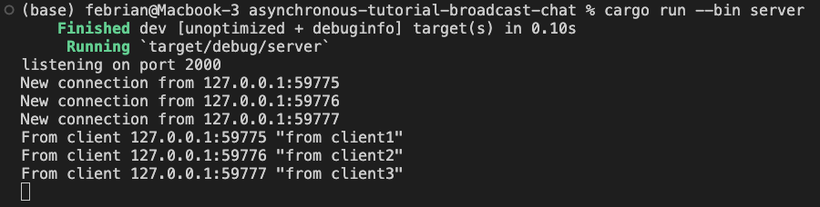
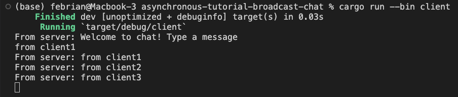
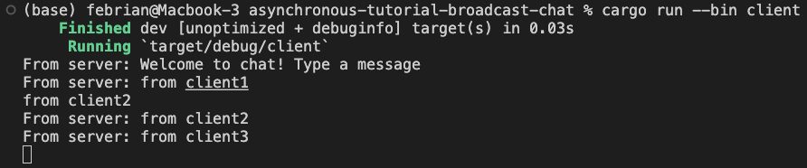
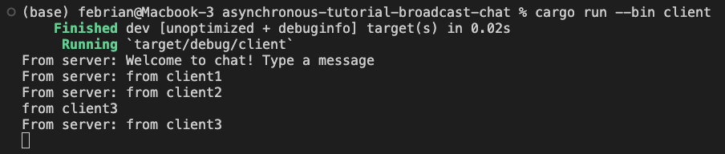

## 2.1. Original code of broadcast chat
#### Server Terminal

#### Client Terminal
Client 1

Client 2

Client 3

1 server dan 3 client dibuka pada pada 4 terminal berbeda. Terlihat bahwa setiap input message dari client akan dikirim kepada server dan diprint diserver itu sendiri. Setelah itu, server akan mengirimkan message itu kembali kesetiap client yang terhubung untuk diprint pada client tersebut.

